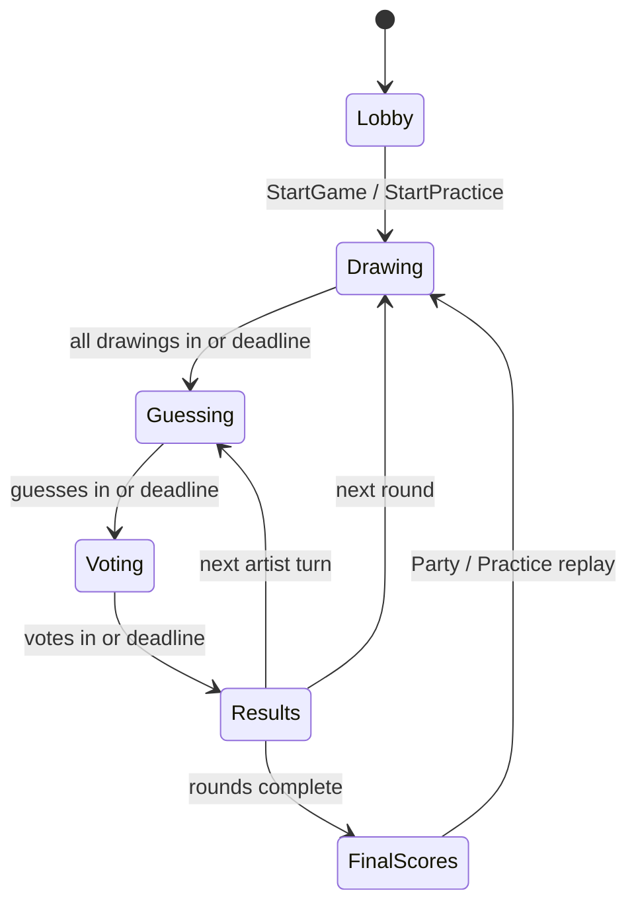

# Architecture

Draw Party is a TV display + phone controllers party game. The Rust server is authoritative for rooms, phases, deadlines, scoring, reconnects, and cleanup. The Vite + TypeScript client renders TV/player UI, captures drawings, validates server messages, and stages some presentation polish.

See also: [protocol.md](protocol.md) for the wire contract.

## Authority split

| Concern | Owner |
|---------|-------|
| Room lifecycle, host token, roster, settings | Server (`server/src/engine.rs`, `server/src/main.rs`) |
| Phase transitions and deadlines | Server engine |
| Prompt assignment and scoring | Server engine |
| Reconnect / dropout progress rules | Server engine |
| WebSocket auth, static serving, `/api/health` | Server (`server/src/main.rs`) |
| TV/phone rendering and drawing input | Client |
| Protocol guards (reject unknown/malformed) | Client (`client/src/protocol.ts`) |
| Results reveal staging (hold → tally → correct → deltas → complete) | Client (`client/src/hooks/useRevealStage.ts`) |
| PWA shell cache (not `/api/*` or `/ws`) | Client (`client/public/sw.js`) |

Do not reintroduce peer-to-peer room authority or client-owned phase transitions. The display may request Continue early during Results; the engine still owns whether and when the phase advances.

## Game phases

1. **Lobby** — display creates room + QR/code; phones join; display adjusts timers/rounds/prompt pack. Party requires three connected phones; one phone can explicitly start unscored Practice.
2. **Drawing** — each connected non-spectator draws an assigned prompt and submits once they have ink.
3. **Guessing** — one drawing at a time; non-artist players submit titles; reactions allowed. The server accepts every sanitized title without revealing whether it matches the truth or another player's title.
4. **Voting** — non-artists pick the real prompt; artist watches; reactions allowed. A normalized truth match is omitted from the fake list and becomes that player's locked correct vote. Normalized duplicate fakes share one option, and every coauthor is blocked from voting for it. If no fake remains, the server skips the trivial truth-only ballot: truth matchers keep their locked correct votes, non-submitters receive no vote, and a turn with no guesses awards nothing.
5. **Results** — server publishes `RoundResult`; client stages reveal; engine auto-advances after `resultsSeconds` unless display Continues early.
6. **FinalScores** — podium after configured rounds; display can restart or export a share card after a server-enforced three-second celebration window. Practice always finishes after one drawing round and must be explicitly replayed as Practice.

During Drawing, Guessing, or Voting, the display or host phone may extend the current server deadline by 30 seconds once. Extension is rejected after expiry and resets only when the engine begins the next timed turn.

## Scoring (engine)

Values live in `server/src/engine.rs` (`finish_voting`):

| Event | Points |
|-------|--------|
| Correct vote | +200 to voter, +100 to artist |
| Vote for a fake answer | +50 total to that fake's author(s) |
| Nobody found it (at least one vote, no correct votes) | +50 to artist |
| Perfect truth (every eligible voter picks correct) | +25 to artist per eligible voter |

Spectators are not eligible voters. The artist is never an eligible voter for their own turn. At Results close, the eligible cohort contains assigned non-artists who are still connected plus anyone whose vote was already accepted before disconnecting. A disconnected non-voter neither blocks progress nor denies perfect truth. Practice produces the reveal result but never awards points.

When normalized duplicate fakes are merged, Results names every coauthor. Each fooled voter's +50 award is split once across those coauthors: player IDs are sorted, integer division supplies the base share, and any remainder is assigned in that order. The related `fooledPlayer` events therefore total exactly 50 for each fooled voter.

Every award also produces a typed causal score event. Per-player event sums equal `ScoreDelta.delta`, and `ScoreDelta.scoreAfter` is the authoritative post-award total.

## Reconnect and dropout

- Disconnected players remain on the roster with `connected: false`.
- Progress does not wait forever on disconnected players: once all **connected** eligible players have submitted (draw / guess / vote), the engine can advance.
- Player re-join sets `connected: true`; display re-attach re-registers the display via host token. Heartbeats are keepalive only (`Pong`); they do not flip `connected`.
- The first connected phone is the room host (`players[].isHost`) and may change lobby settings, start the game, add 30 seconds to a timed turn, Continue results, or Play Again. Host is sticky while that player stays connected; if they disconnect, the engine promotes the earliest-joined connected non-spectator, otherwise the earliest-joined connected player. The client renders the +30 control only on the host phone. The TV display remains server-authorized as an optional remote / e2e fallback, but party play should not require a TV remote after the room code appears.
- If a display reconnects to an expired room (`room_not_found`), the client clears the stale host token and creates a fresh lobby.
- A between-round Results deadline that cannot advance because every player is disconnected becomes quiescent instead of retrying and logging every maintenance tick. A returning player re-arms the transition deadline; without one, failed deadline work does not refresh activity and the fully disconnected room remains eligible for normal TTL cleanup.
- Player controllers may keep one optional, tab-scoped `sessionStorage` draft for the current Drawing or Guessing turn. Drafts expire after 5 minutes, are capped at 1 MiB, and are bound to room, player, phase, and server turn (plus artist for guesses). Votes are never cached, drafts are never auto-submitted, and a draft never becomes pending server state. An authoritative snapshot that shows acceptance, a phase/turn/artist or identity mismatch, or an explicit room/session exit clears the draft.
- Explicit renames are the separate pending-mutation exception. A controller may keep one tab-scoped, room/client-bound rename intent for up to 3 hours and 2 KiB, replay its UUID-correlated request after reconnect, and coalesce a later edit behind it. The client clears the intent only after its matching `nameSet` acknowledgement, the documented older-server snapshot fallback, or a terminal room/session exit; stale acknowledgements cannot settle a newer rename.
- A blank Drawing timeout suspends that mode's assignments for a same-mode retry. Explicitly starting the other mode abandons the suspended assignment and begins a fresh game at round one with the currently connected roster. Selecting another valid prompt pack in this retry lobby also abandons the hidden assignment, promotes connected replacement spectators into the active fresh-lobby roster, and makes the next start fresh.

## Spectators and seat limits

- `MAX_PLAYERS` (8) includes spectators. Late joiners still consume a seat.
- Mid-game joiners arrive as `PlayerPublic.spectator: true` until the next drawing round, when the engine promotes them. A replacement waiting on a suspended blank-drawing retry remains a spectator only while that retry is preserved; abandoning it promotes connected replacements in the resulting fresh lobby.
- Practice never promotes a late joiner during that game; it remains a one-player drawing round.
- Lobby readiness and progress panels should count **active** (non-spectator) players only. Client helpers live in `client/src/spectator.ts`.

## Client vs server on Results

The server decides scores and when Results ends. The client only stages presentation:

- Hold → tally (votes) → correct answer → score deltas → complete via `client/src/hooks/useRevealStage.ts`
- Outcome copy, podium titles, and action hints live in `client/src/polish.ts` (not reveal timing)

Changing reveal theater does not change scoring; changing scoring requires engine + tests updates and usually a docs touch here.

## Prompt freshness

Prompt keys remain used across Play Again so consecutive games do not immediately repeat prompts. When the selected pack has fewer unused prompts than the next complete assignment needs, the engine clears that history and draws a unique full round from the complete pack. A suspended empty-drawing retry keeps its original assignments and never consumes a second set. If the host abandons that retry by switching between Party and Practice or selecting another prompt pack, those already-seen prompt keys remain used while the fresh game receives new assignments.

## Key source map

| Area | Path |
|------|------|
| Room/phase/scoring | `server/src/engine.rs` |
| Engine unit tests | `server/src/engine/tests.rs` |
| Prompt packs | `server/src/prompts.rs` |
| HTTP/WS/static/health | `server/src/main.rs` |
| Protocol types | `server/src/protocol.rs`, `client/src/protocol.ts` |
| Client WS + state | `client/src/app/GameProvider.tsx` |
| Pending rename recovery | `client/src/pending-rename-cache.ts` |
| Phase router | `client/src/app/App.tsx` |
| Display / player screens | `client/src/views/` |
| Drawing pad | `client/src/drawing.ts` |
