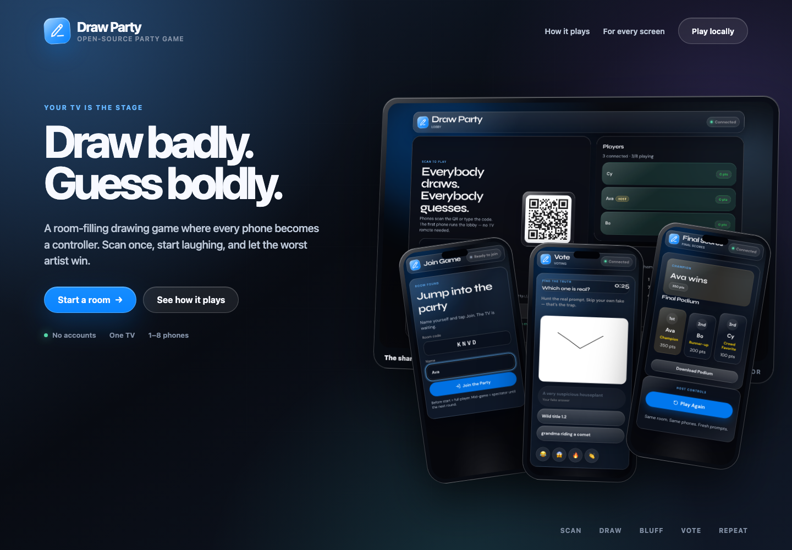
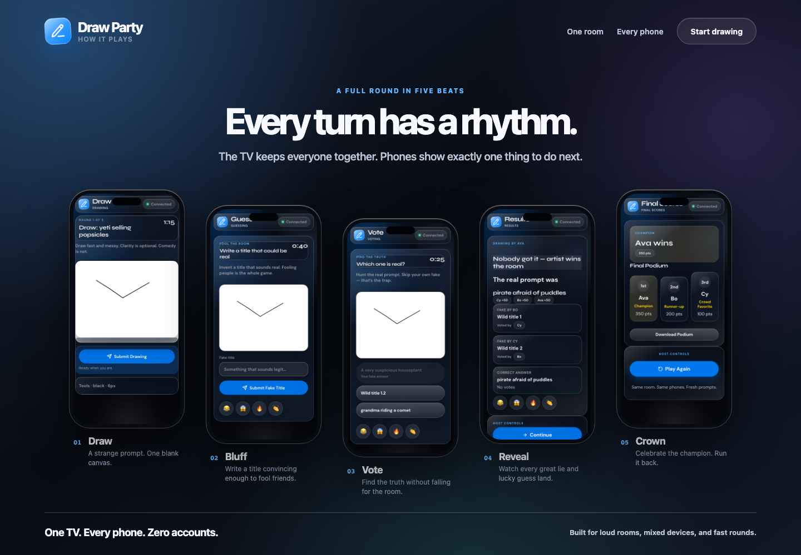
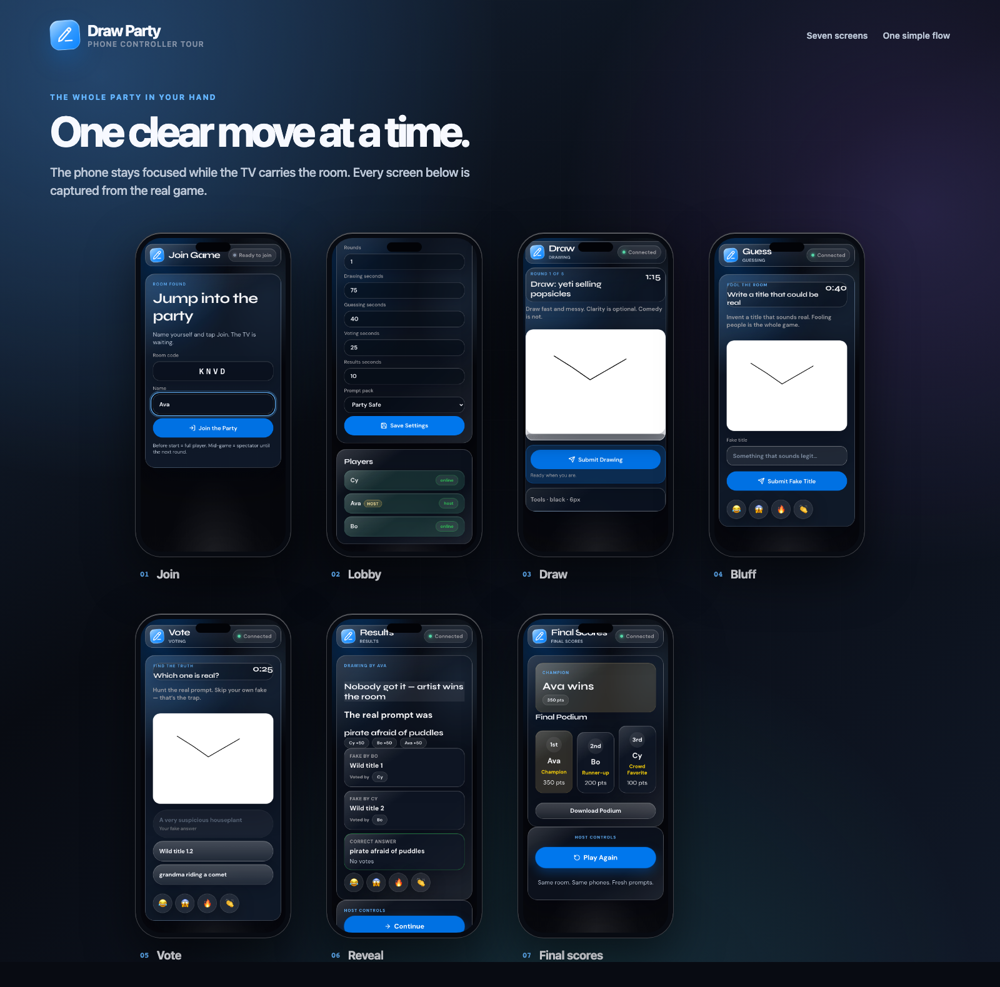

# Draw Party Marketing Reference

This folder preserves the July 2026 visual direction for Draw Party. The compositions use screenshots captured from a real game running the Party Glass interface; they are reference material for future website, store-listing, social, and launch work.

## Lead tagline

> Draw badly. Guess boldly.

Supporting line:

> Your TV is the stage. Every phone is a controller.

## Primary compositions

### Advertising hero

### How it plays

### Phone controller tour

## Source captures

The `screenshots/` directory also includes the uncomposited game captures:

- Phone: join, lobby, drawing, guessing, voting, results, and final scores.
- TV: lobby, guessing, results, and final scores.

Room codes, prompts, player names, and scores are illustrative data from local test sessions. Refresh these assets when the interface changes materially so the marketing reference remains honest to the shipped game.
